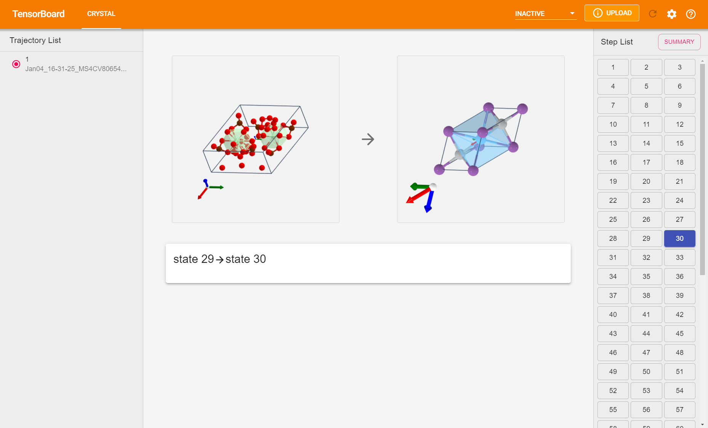

# CrystalBoard
CrystalBoard is a plugin that can be used to visualize crystal structures.


## Show Case


## Installation
CrystalBoard can be installed with `pip` with
```python
cd tb_plugin
python setup.py install
```
Due to the limitation of TensorBoard, you need to manually modify the default num of tensors for visualization, modify `python_dir/Lib/site-packages/tensorboard/backend/event_processing/data_ingester.py`:
```python
# Line 35 ~ 37
DEFAULT_SIZE_GUIDANCE = {
    tag_types.TENSORS: 10,
}
# to
DEFAULT_SIZE_GUIDANCE = {
    tag_types.TENSORS: 100,  # can be higher if you want
}
```

## Data Summary
We can have a custom Summary Writer class to record data conveniently.
```python
# use our custom SummaryWriter
from crystalboard import CrystalSummaryWriter
from pymatgen.core import Structure

writer = CrystalSummaryWriter()

# You should not attach info for initial structure, as info parameter stores step info.
init_structure = Structure(...)
writer.add_crystal(tag="tag", structure=init_structure)

for loop:
    structure = Structure(...)
    step_msg = {
        "action": "What action took place in this step",
        "step_reward": 1.0,
        # ... anything else you want to show on the tensorboard
    }
    # both structure and info are optional, if both of them are missing,
    # no record will be taken
    # For more about how the info is showed on screen, see next section.
    writer.add_crystal(tag="tag", structure=structure, info=step_msg)

# By default, the last info added is the summary info of this tracjectory,
# there is no need for structure as the final structure has been added in last step in the loop.
summary = {
    "total_reward": 10.0,
    "step_length": 6
}
writer.add_crystal(tag="tag", info=step_msg)

```

## Visualization
The frontend show the change of crystals in one step or in the whole tracjectory (summary view). It retrieves data as follow:
```
Structure: 0   1   2   3   4   5   6   ....   9
           |___|___|___|___|___|___|__ .... __|
     Step:   1   2   3   4   5   6   7 .... 9
             ↓   ↓   ↓   ↓   ↓   ↓   ↓ .... ↓
     Info:   0   1   2   3   4   5   6 .... 8  + SUMMARY   
```
For example, if you choose step `4`, the page will show how the crystal changes from state `3` to state `4`. And the `third` info in the tensorboard backend database.

Note that we did not index the step from 0 in the web page as indexes starting from 1 are more natural for most people.


## Build crystalboard's frontend
```Shell
cd crystalboard
yarn install
yarn build
```
